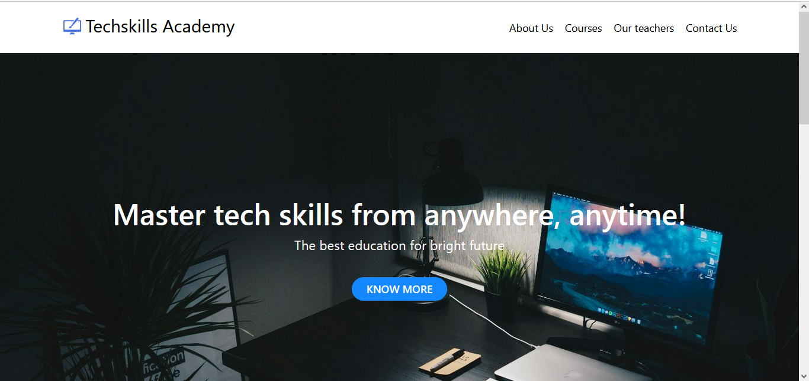

# Online IT courses website 

This project aims to create an informative and user-friendly website that provides a comprehensive overview of online IT courses available from various platforms. Our goal is to help learners find suitable courses and plateform to enhance their skills in information technology.

## Overview of the website
- In the above image, You can navigate to the about-us section to explore more about the couses you are interested in.
- When you go to the upper right corner, you can find the contact page. Feel free to ask your question about couses and certifications.

### 24 hours active professors 
Get in touch directly with our techers who can help you when you encounter any difficulty with the content.

### Features 

**Course Listings**: Browse a curated list of online IT courses from popular platforms.
- **Course Reviews**: Read user reviews and ratings for each course.
- **Responsive Design**: Access the website seamlessly on desktop and mobile devices.
- **Free online quiz**: To test your knowledge, in each course we have quizes to solve.

### Technologies Used

- **HTML**: For structuring the web pages.
- **CSS**: For styling and layout.
